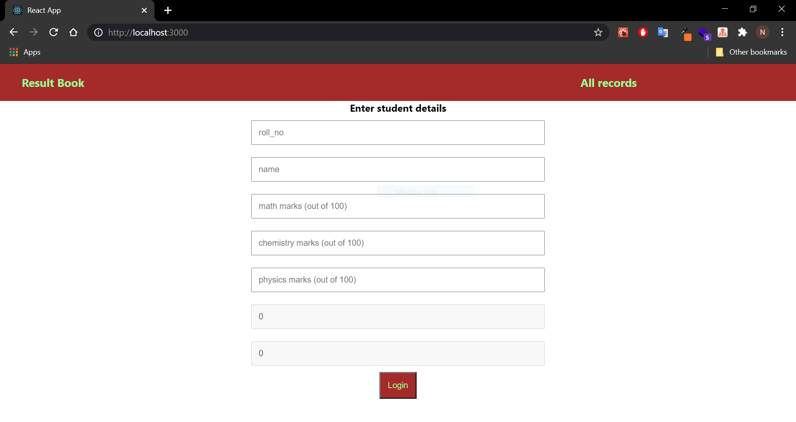
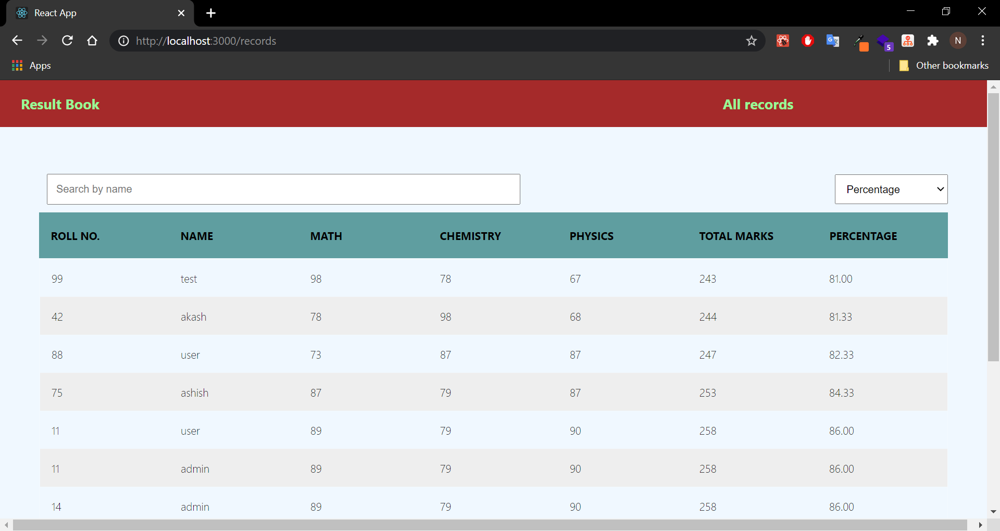

# Record maintain app

A single page application to store student marks, This application built using React, Flask and SQLite3. The frontend was implemented using ReactJS. The backend web server was built using Flask and a SQLite3 server to store the tasks.

**Functionality**:

- A user can add perticular student marks
- A user view all submitted records
- User can also search for a record based on text filtering.

**Build**:

For Backend

`cd backend`

Database: `sqlite3 database/database.db -init database/schema.sql`

Server: `python app.py`

For Frontend

`cd frontend-app`

Install dependency: `yarn add`

Start frontend: `yarn start`
